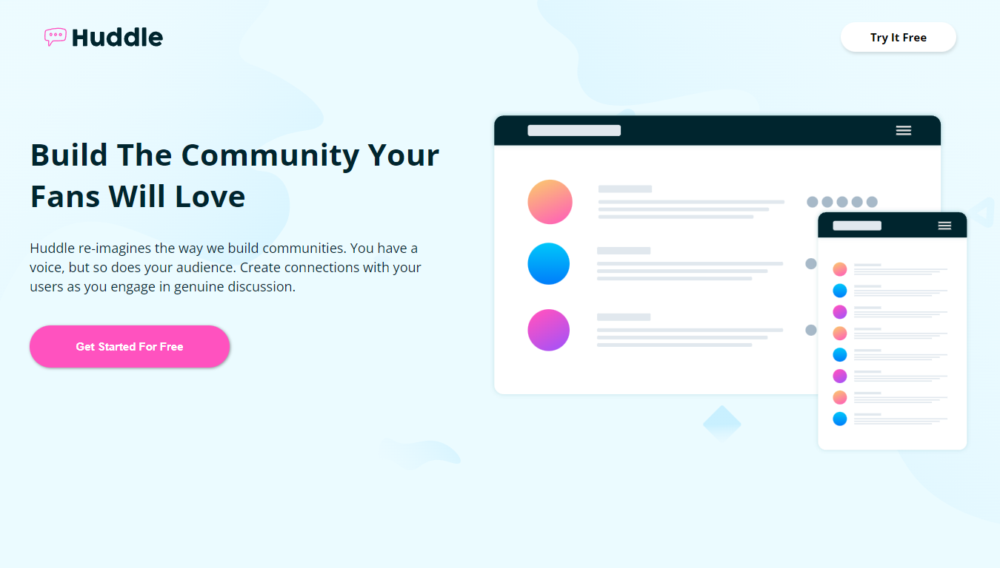
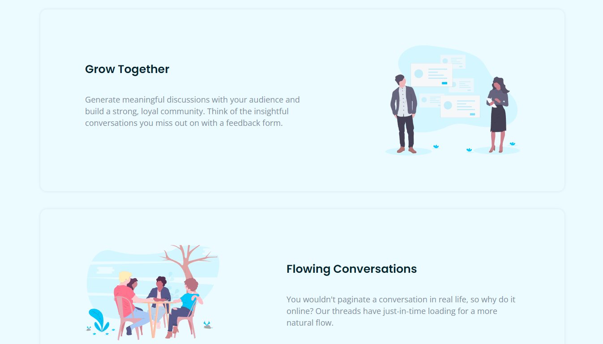
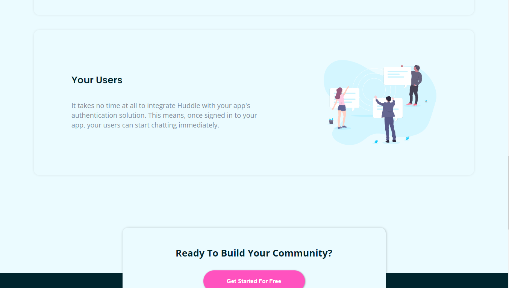
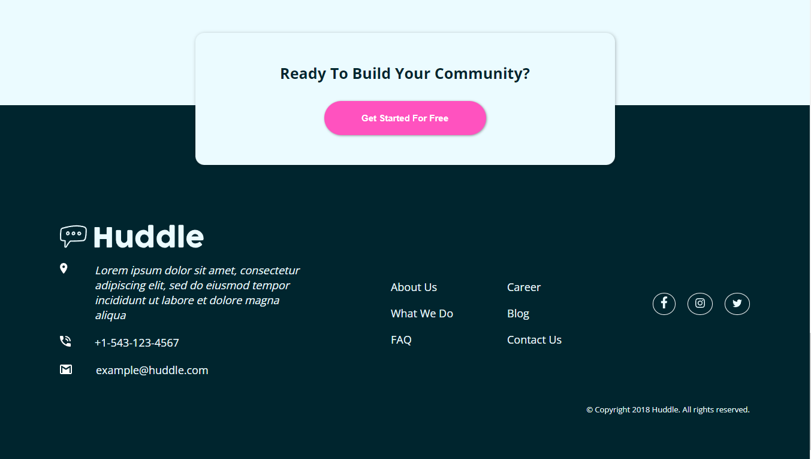
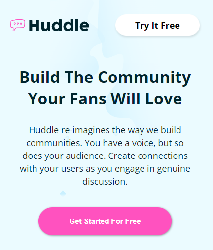
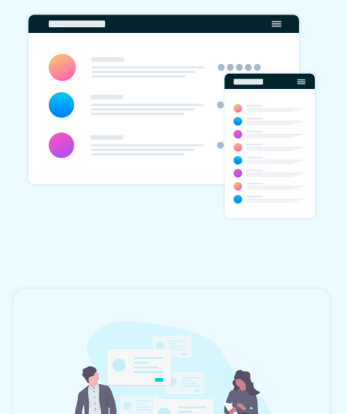
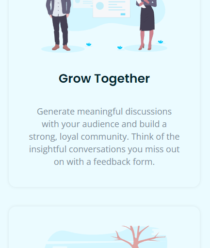
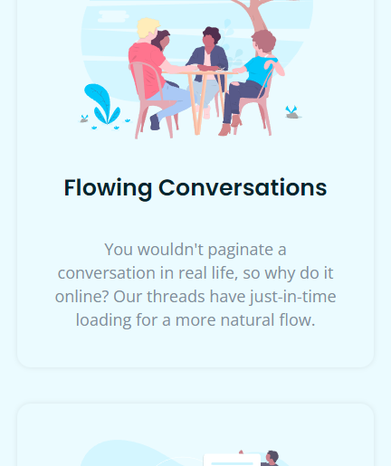
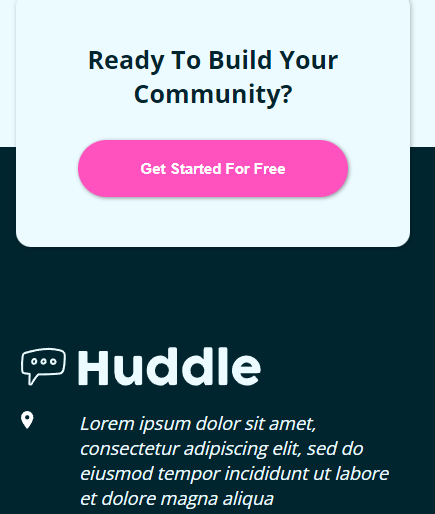
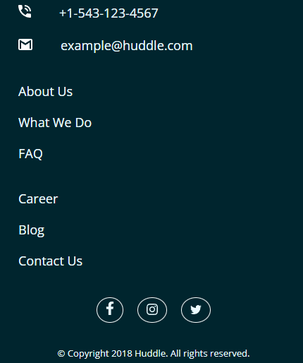

# Frontend Mentor - Huddle landing page with alternating feature blocks solution

### Screenshot

### Links

- Solution URL: [https://github.com/Wellissonb/huddle-landing-page-with-alternating-feature-blocks]
- Live Site URL: [https://github.com/Wellissonb/huddle-landing-page-with-alternating-feature-blocks]

## My process

### Built with

- Semantic HTML5 markup
- CSS custom properties
- Flexbox
- Mobile-first workflow

